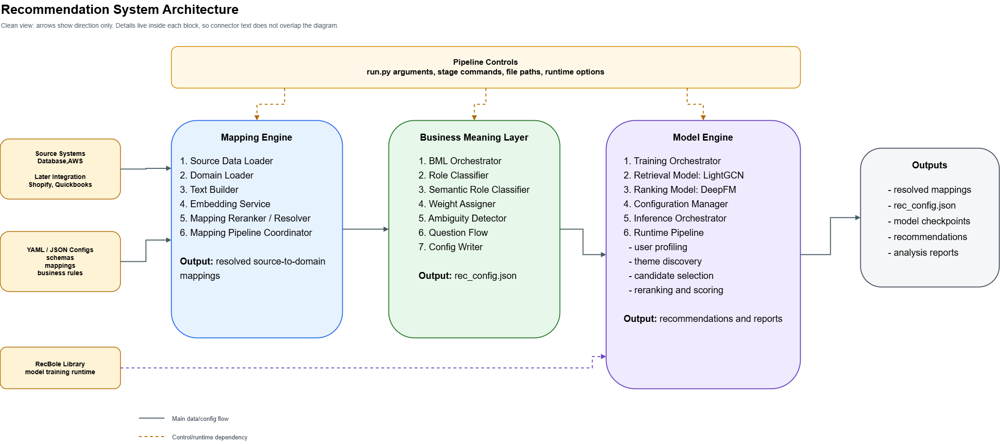

# Autonomous Mapping Engine & Business Meaning Layer

A data-driven, AI-powered pipeline designed to automatically resolve source data columns to a canonical target schema and classify them into functional business roles. This system leverages a hybrid approach of semantic embeddings, cross-encoders, and business-logic boosts to achieve high-confidence mappings and actionable configurations.

---

## System Flow



---

## Detailed Operational Flow

The pipeline operates in two distinct stages, moving from raw column detection to final business configuration.

### Step 1: The Mapping Engine (Discovery & Alignment)
This stage focuses on identifying **what** each source column represents in the context of the target canonical schema.

1.  **Registry Building (The Foundation)**:
    The `Domain Loader` performs a "Cold Start" consolidation. It reads multiple YAML manifests—`schema`, `keywords`, `rules`, and `metrics`. It resolves inherited properties and creates a unified **Target Registry** where every field is enriched with synonyms, business descriptions, and logic constraints.

2.  **Semantic Retrieval (The Fast Filter)**:
    Using a Bi-Encoder model (`all-MiniLM-L6-v2`), the engine converts all target field descriptions into a high-dimensional vector space. For every source column, it performs a **Vector Similarity Search** to instantly find the **Top-K semantic candidates**.

3.  **Contextual Reranking (The Deep Thinker)**:
    Top candidates are passed to a `Cross-Encoder` (`stsb-distilroberta-base`). It performs a **Deep Attention** comparison, reading the source column name and table context against the target's full business description.

4.  **Signal Blending & Rationale**:
    The engine calculates a `final_confidence` score using a balanced signal blend:
    *   **50% Cross-Encoder**: Analyzes source and target *simultaneously* for deep contextual awareness.
    *   **25% Bi-Encoder**: Supporting semantic signal from fast vector search.
    *   **15% Lexical Match**: Programmatic check for exact or fuzzy name matches.
    *   **10% Metadata**: Tie-breaker based on data types and entity labels.

5.  **Logic Boosting**:
    Explicit knowledge injection via YAML manifests.
    *   **Keyword Intent**: Synonym-based boosts (e.g., "rev" -> "revenue" = +0.30).
    *   **Context Rules**: Conditional overrides based on table or entity context.

6.  **Global Resolution**:
    Enforces a **Global 1:1 Constraint** for the entire column set, ensuring no mapping collisions.

---

### Step 2: Business Meaning Layer (Classification & Context)
Once we know *what* a column is, we must determine **how it functions** within the recommendation ecosystem.

1.  **Functional Classification**:
    Categorizes columns into functional buckets: **Identity**, **Interaction Signals**, **Content Features**, or **Filters**.

2.  **Intelligent Weighting**:
    Assigns business weights to signals (e.g., *Purchase* = 1.0, *View* = 0.1) based on `metrics.yaml`.

3.  **Ambiguity Detection**:
    Flags columns with low confidence or role conflicts for human review.

4.  **Human-in-the-Loop**:
    Triggers a **Question Flow** to resolve uncertainties through natural language interaction.

---

## Project Structure

```text
RecSys/
├── Mapping_Engine/          # Step 1: discovery & alignment
│   ├── Domain_loader/       # manifest & schema ingestion
│   ├── embedding_matcher/   # vector retrieval
│   ├── Reranking/           # cross-encoder & logic boost
│   └── test.py              # mapping engine entry point
│
├── Business_Meaning/        # Step 2: classification & configuration
│   ├── business_layer.py    # orchestrator
│   ├── role_classifier.py   # functional categorization
│   ├── ambiguity_detector.py # review trigger logic
│   └── run.py               # full pipeline entry point
│
├── ecommerce/               # Domain Configuration (The intelligence)
│   ├── schema.yaml          # canonical field definitions
│   ├── manifest.yaml        # pack metadata
│   ├── rules.yaml           # mapping logic boosts
│   ├── keywords.yaml        # semantic synonyms
│   ├── metrics.yaml         # business weighting formulas
│   ├── validations.yaml     # data quality rules
│   └── questions.yaml       # HITL question bank
│
├── output/                  # generated artifacts
│   ├── resolved_mappings.json # intermediate AI decisions
│   └── rec_config.json      # final business configuration
│
└── data.csv                 # example source data
```

---

## How to Start

### 1. Prerequisites
- Python 3.8+
- [Recommended] Virtual Environment

### 2. Installation
```bash
# Clone the repository
git clone <repo-url>
cd RecSys

# Create and activate virtual environment (Windows)
python -m venv venv
.\venv\Scripts\activate

# Install dependencies
pip install -r requirements.txt
```

### 3. Running the Pipeline

#### Option A: Run Full Pipeline (End-to-End)
```bash
python Business_Meaning/run.py --columns data.csv --domain-dir ecommerce
```

#### Option B: Run Mapping Engine Only (Step 1)
```bash
python Mapping_Engine/test.py --columns data.csv
```

---

## Configuration (Manifests)

The system is entirely **data-driven**. All business knowledge is stored in the `ecommerce/` directory.

- **`schema.yaml`**: The **Source of Truth** for target fields.
- **`manifest.yaml`**: Summary of the domain pack requirements.
- **`keywords.yaml`**: The **Semantic bridge** for project-specific jargon.
- **`rules.yaml`**: The **Decision Engine** for logic-based overrides.
- **`metrics.yaml`**: The **Performance Formulas** for weighting.
- **`validations.yaml`**: The **Integrity Layer** for quality checks.
- **`questions.yaml`**: The **Clarification Bank** for human feedback.

---

## Outputs

- **`output/resolved_mappings.json`**: AI mapping decisions and confidence scores.
- **`output/rec_config.json`**: Final 1:1 business categorization for downstream use.
