# RecSys — Complete Technical Architecture


---

## Table of Contents

| Part | Topic |
|------|-------|
| [Part 1](#part-1--project-file-structure) | Project File Structure |
| [Part 2](#part-2--api-boot-sequence) | API Boot Sequence |
| [Part 3](#part-3--domain-loading--yaml-manifests) | Domain Loading — YAML Manifests |
| [Part 4](#part-4--text-building--bi-encoder-embedding) | Text Building & Bi-Encoder Embedding |
| [Part 5](#part-5--reranker--5-signal-scoring) | Reranker — 5-Signal Scoring |
| [Part 6](#part-6--11-global-resolver) | 1:1 Global Resolver |
| [Part 7](#part-7--business-meaning-layer) | Business Meaning Layer |
| [Part 8](#part-8--refinery--config-builder) | Refinery & Config Builder |
| [Part 9](#part-9--model-training) | Model Training |
| [Part 10](#part-10--autotherapydiscovery--theme-engine) | AutoThemeDiscovery — Theme Engine |
| [Part 11](#part-11--inference-loop--scoring--selection) | Inference Loop — Scoring & Selection |
| [Part 12](#part-12--master-diagram) 

---

## Part 1 — Project File Structure

> Every file in the project and what it does.

```
e:/RecSys/
│
├── api_service.py                  ← Entry point. Creates Flask app, starts warmup thread.
│
├── api/
│   ├── __init__.py                 ← App factory: create_app(), registers blueprints
│   ├── state.py                    ← Global singletons (MATCHER, CROSS_ENCODER, etc.)
│   ├── pipeline.py                 ← run_headless_mapping_pipeline() — core job runner
│   └── routes/
│       ├── __init__.py             ← Re-exports health_bp, jobs_bp, orchestrator_bp
│       ├── health.py               ← GET /api/health, GET /api/schema-details
│       ├── jobs.py                 ← ENV switch: local vs AWS
│       ├── jobs_local.py           ← All 5 job routes — local file + InMemoryStore
│       └── jobs_aws.py             ← All 5 job routes — S3 + Glue + DynamoDB
│
├── Mapping_Engine/
│   ├── __init__.py
│   ├── Domain_loader/
│   │   ├── __init__.py
│   │   ├── domain_loader.py        ← build_target_registry(), build_keyword_intent_index()
│   │   ├── detection.py            ← Domain detection helpers
│   │   └── main.py                 ← CLI entrypoint for loader
│   ├── embedding_matcher/
│   │   ├── __init__.py
│   │   └── embedding.py            ← class Embedding: fit_targets(), match_column()
│   ├── text_builder/
│   │   ├── __init__.py
│   │   └── text_builder.py         ← build_source_text(), build_target_text()
│   ├── Reranking/
│   │   ├── __init__.py
│   │   ├── Reranker.py             ← rerank_candidates(), 5-signal scoring formula
│   │   └── Resolver.py             ← resolve_mappings(), global 1:1 constraint
│   ├── sample_columns.json         ← Example source columns for testing
│   └── test.py                     ← Manual test runner
│
├── Business_Meaning/
│   ├── __init__.py
│   ├── business_layer.py           ← BusinessMeaningLayer orchestrator
│   ├── role_classifier.py          ← RoleClassifier, classify_role()
│   ├── semantic_classifier.py      ← SemanticRoleClassifier (embedding fallback)
│   ├── weight_assigner.py          ← WeightAssigner, assign_weight()
│   ├── ambiguity_detector.py       ← is_ambiguous()
│   ├── question_flow.py            ← QuestionFlow, _load_questions(), _ask_role()
│   ├── config_writer.py            ← ConfigWriter, builds + writes rec_config.json
│   ├── run.py                      ← Standalone CLI runner for Business Meaning
│   └── test_business_layer.py      ← Unit tests
│
├── Model_Engine/
│   ├── refinery.py                 ← run_refinery(): CSV → RecBole atomic files
│   ├── config_builder.py           ← build_configs(): writes training YAML files
│   ├── run_stage1.py               ← Train LightGCN + DeepFM via RecBole
│   ├── run_stage2.py               ← User Control Panel → calls inference.py
│   ├── default_heuristics.yaml     ← Fallback rating heuristics
│   ├── intelligent_rules.yaml      ← Extra business rules
│   ├── ranking_config.yaml         ← [AUTO-GENERATED] DeepFM config
│   ├── retrieval_config.yaml       ← [AUTO-GENERATED] LightGCN/SASRec config
│   ├── model_choice.json           ← [AUTO-GENERATED] suggested model name
│   ├── checkpoints/                ← LightGCN-*.pth, DeepFM-*.pth
│   ├── rec/                        ← rec.inter, rec.item, rec.user (RecBole TSV)
│   └── pipeline/
│       ├── __init__.py
│       ├── config.py               ← @dataclass PipelineConfig — all tunable knobs
│       ├── data_utils.py           ← resolve_paths, load_recbole_model, popularity scores
│       ├── inference.py            ← run_stage2_semantic_inference() — main orchestrator
│       ├── theme_discovery.py      ← AutoThemeDiscovery — KMeans clustering
│       ├── user_profiler.py        ← UserInterestProfiler — theme weights per user
│       ├── scoring.py              ← compute_per_user_scores() — weighted formula
│       ├── selector.py             ← select_recommendations() — quota-based greedy
│       └── reranker.py             ← ThompsonReranker — Beta distribution multiplier
│
├── ecommerce/                      ← Domain Knowledge (the "brain" of Phase 1)
│   ├── schema.yaml      (180 KB)   ← Canonical entities + fields definition
│   ├── keywords.yaml     (80 KB)   ← Per-field synonyms + match priority
│   ├── rules.yaml        (29 KB)   ← Field/entity recognition + conflict rules
│   ├── metrics.yaml      (11 KB)   ← Derived metrics that reference fields
│   ├── validations.yaml  (77 KB)   ← Data quality checks per entity
│   ├── questions.yaml    (15 KB)   ← Business context Q&A for ambiguous fields
│   ├── classifier_rules.yaml(3 KB) ← Role classification rules + signal weights
│   └── manifest.yaml     (1.2 KB) ← Domain manifest metadata
│
├── output/
│   ├── rec_config.json             ← THE bridge: mapping result used by all later phases
│   ├── rec_config.lock             ← Lock file to prevent concurrent writes
│   ├── final_recommendations.json  ← Final output: per-user recommendations
│   └── uploads/                    ← Saved CSV files from API uploads
│
├── data/
│   ├── steam-200k.csv     (8.5 MB) ← Sample Steam gaming dataset
│   └── steam_with_headers.csv      ← Same with explicit headers
│
├── data.csv               (43 MB)  ← Main working dataset
└── requirements.txt                ← Python dependencies
```

---

## Part 2 — API Boot Sequence

> What happens from `python api_service.py` until the first request can be served.

```mermaid
sequenceDiagram
    participant OS  as Terminal
    participant AS  as api_service.py
    participant AF  as api/__init__.py
    participant HB  as health.py (Blueprint)
    participant JB  as jobs.py (Blueprint)
    participant ST  as api/state.py
    participant DL  as domain_loader.py
    participant EM  as embedding.py
    participant CE  as CrossEncoder

    OS->>AS: python api_service.py
    AS->>AF: create_app()

    AF->>HB: register health_bp
    Note over HB: GET /api/health<br/>GET /api/schema-details

    AF->>JB: register jobs_bp
    Note over JB: APP_ENV=local → jobs_local.py<br/>APP_ENV=production → jobs_aws.py

    AF->>ST: warm_models_background()
    Note over AF,ST: Flask is ALREADY running and answering<br/>requests at this point. Models load async.

    ST->>ST: Thread(daemon=True).start()

    rect rgb(40, 60, 80)
        Note over ST,CE: Background Thread — runs while Flask handles traffic
        ST->>DL: Step 1/4 — build_target_registry(schema, keywords, metrics, rules, validations, questions)
        DL-->>ST: TARGET_REGISTRY list of N dicts

        ST->>EM: Step 2/4 — Embedding("all-MiniLM-L6-v2")
        Note over EM: Downloads or loads from cache<br/>SentenceTransformer model

        ST->>EM: Step 3/4 — MATCHER.fit_targets(TARGET_REGISTRY)
        Note over EM: Encodes every target field as 384-dim vector<br/>Stores as (N × 384) matrix in RAM

        ST->>CE: Step 4/4 — CrossEncoder("cross-encoder/stsb-distilroberta-base")
        CE-->>ST: CROSS_ENCODER ready

        ST->>DL: build_keyword_intent_index(keywords.yaml)
        DL-->>ST: KEYWORD_INTENT dict

        ST->>ST: MODEL_READY = True
    end

    Note over OS: GET /api/health now returns {status: ok}
```

**Global singletons stored in `api/state.py`:**

| Variable | Type | What it holds |
|----------|------|---------------|
| `MODEL_READY` | `bool` | Gates all pipeline requests |
| `TARGET_REGISTRY` | `list[dict]` | All canonical fields loaded from 6 YAMLs |
| `MATCHER` | `Embedding` | Bi-encoder + pre-encoded target matrix |
| `CROSS_ENCODER` | `CrossEncoder` | Cross-encoder reranker model |
| `KEYWORD_INTENT` | `dict` | synonym → `{canonical_field, entity, priority}` |
| `ENTITY_THRESHOLD` | `float` | From `questions.yaml` — default 0.80 |
| `FIELD_THRESHOLD` | `float` | From `questions.yaml` — default 0.80 |

---

## Part 3 — Domain Loading — YAML Manifests

> How 6 YAML files are merged into one rich `TARGET_REGISTRY`.

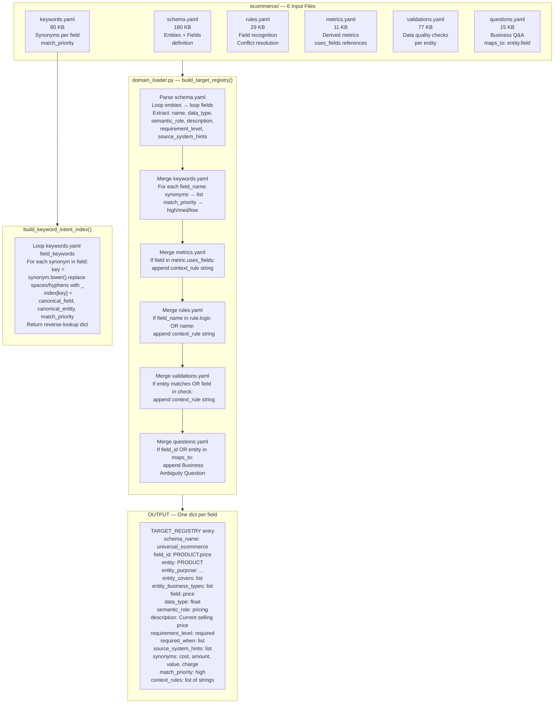

**Example `context_rules` list on one field:**
```
"Metric 'revenue': total revenue earned by the business"
"Rule 'price_conflict': if price and cost both present, prioritize price"
"Validation 'positive_price': price must be > 0"
"Business Ambiguity Question: Is this the final sale price or the list price?"
```

---

## Part 4 — Text Building & Bi-Encoder Embedding

> How source columns and target fields are turned into semantic text, then compared.

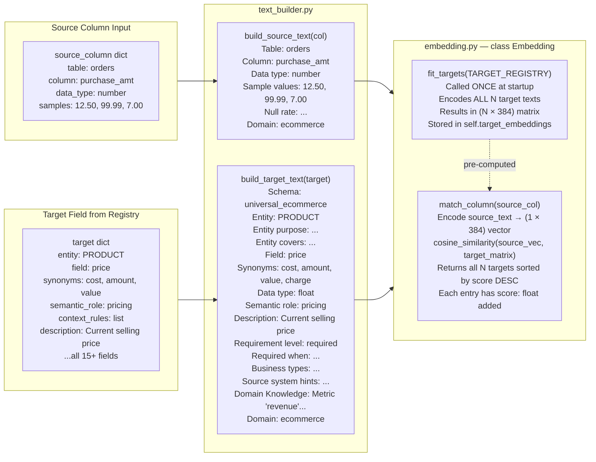

**Why two separate text formats?**

- `build_source_text` keeps it **short** — only what we know about the raw column
- `build_target_text` is **rich** — includes synonyms, rules, metrics, questions — so the embedding captures full business context

---

## Part 5 — Reranker — 5-Signal Scoring

> How every candidate gets a precise confidence score using 5 independent signals.

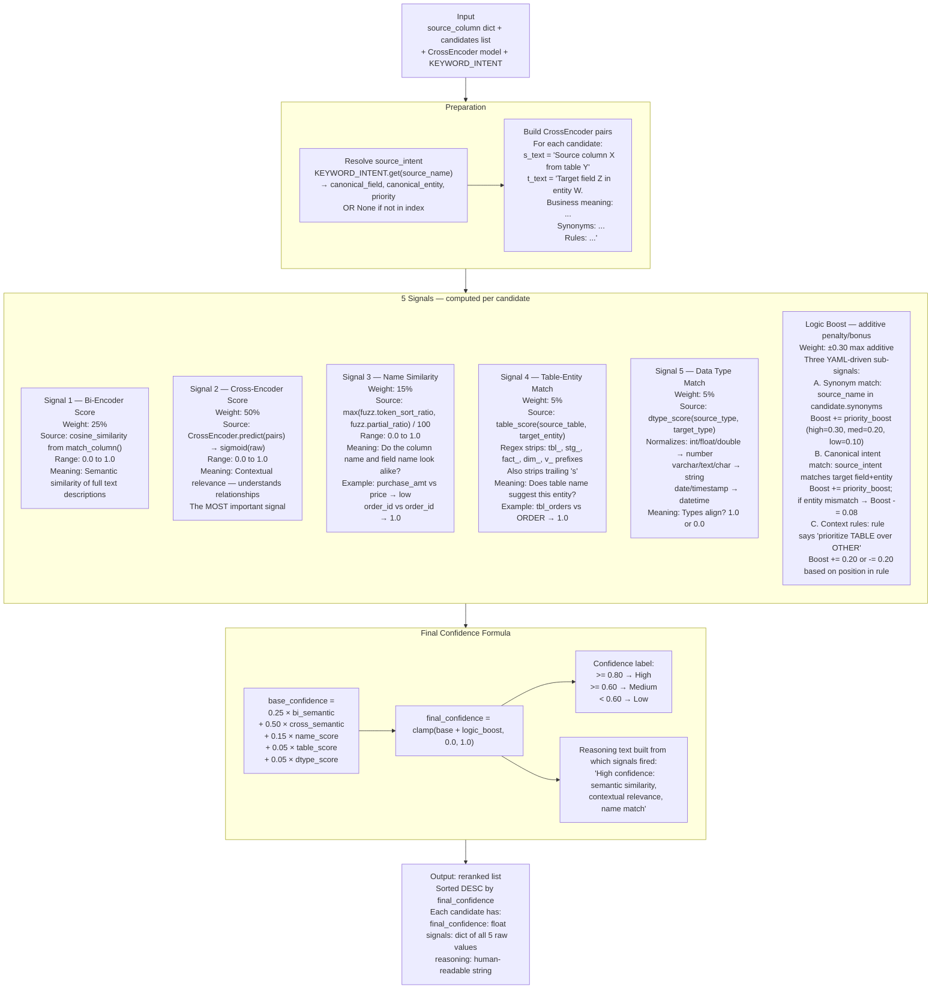

---

## Part 6 — 1:1 Global Resolver

> Ensures no two source columns map to the same canonical field.

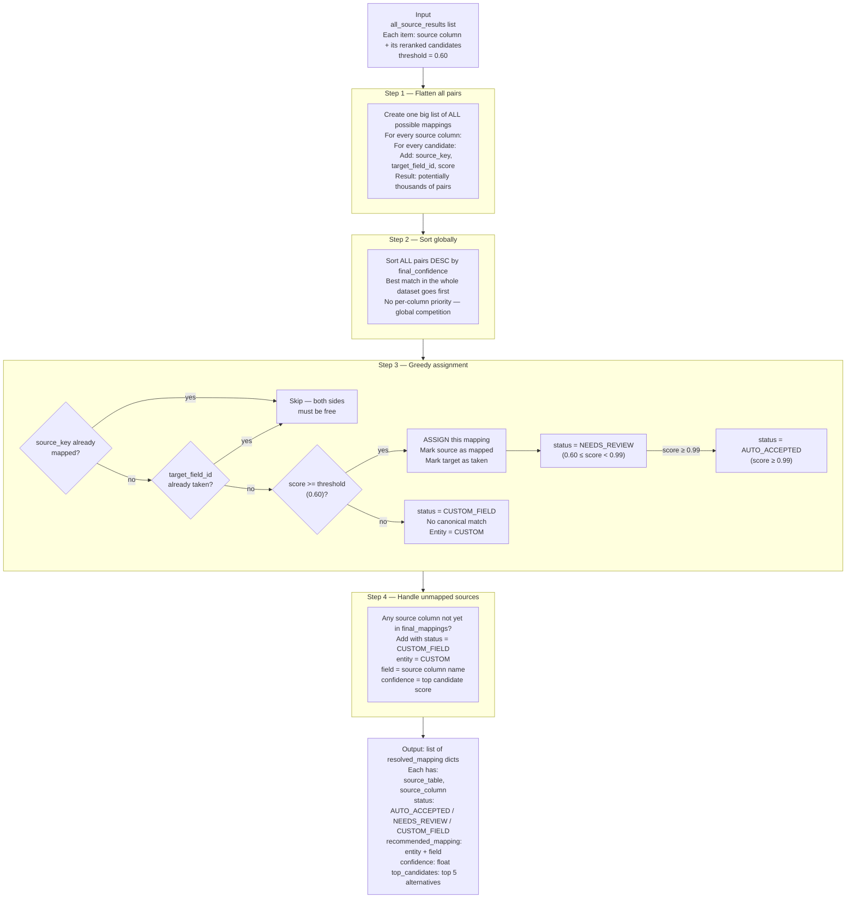

**Why global greedy instead of per-column best match?**

If two columns both want the same field, the one with higher confidence wins. The loser gets its second-best choice instead — preventing duplicate mappings that would break the recommendation model.

---

## Part 7 — Business Meaning Layer

> Classifies what role each mapped column plays in the recommendation system.

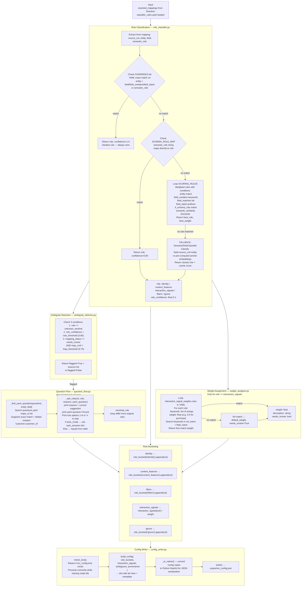

**The 5 roles explained:**

| Role | Meaning | Example columns |
|------|---------|-----------------|
| `identity` | Uniquely identifies a user or item | `customer_id`, `product_id` |
| `content_features` | Describes the item | `game_name`, `category`, `brand` |
| `interaction_signals` | How a user interacted (gets a weight) | `hours_played`, `purchase`, `rating` |
| `filters` | Used to filter the catalog | `platform`, `region`, `age_rating` |
| `ignore` | Not needed by the model | `row_id`, `internal_code` |

---

## Part 8 — Refinery & Config Builder

> Converts the raw CSV into training files the model can actually read.

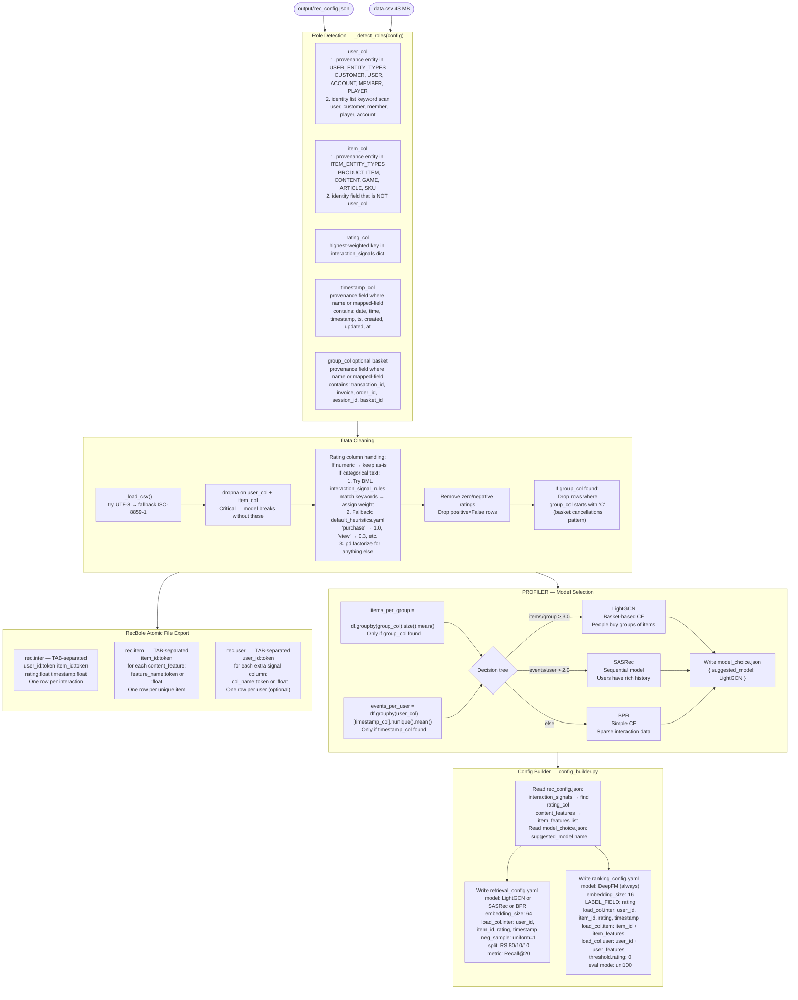

---

## Part 9 — Model Training

> Two sequential training runs using RecBole framework.

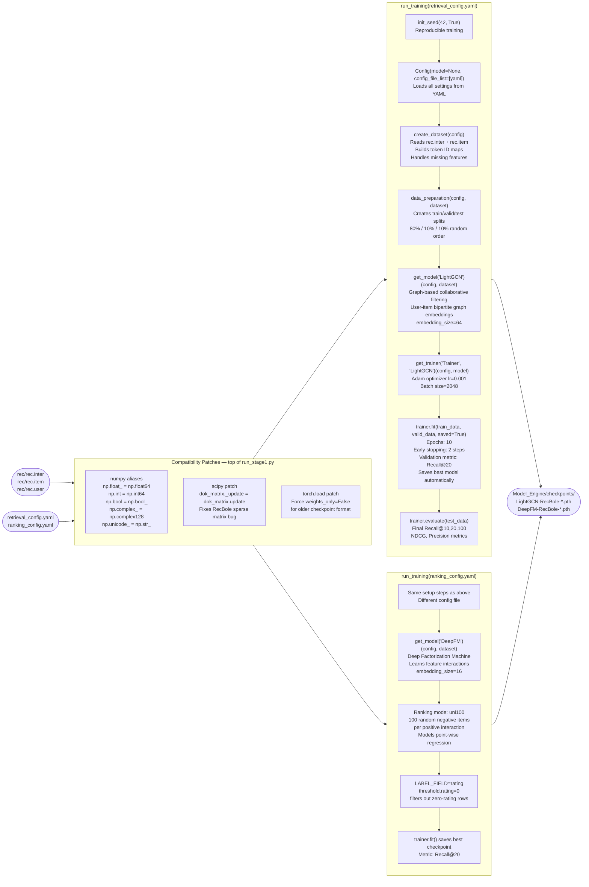

---

## Part 10 — AutoThemeDiscovery — Theme Engine

> Automatically discovers what categories/themes exist in the item catalog.  
> Zero manual configuration. Works on any domain.

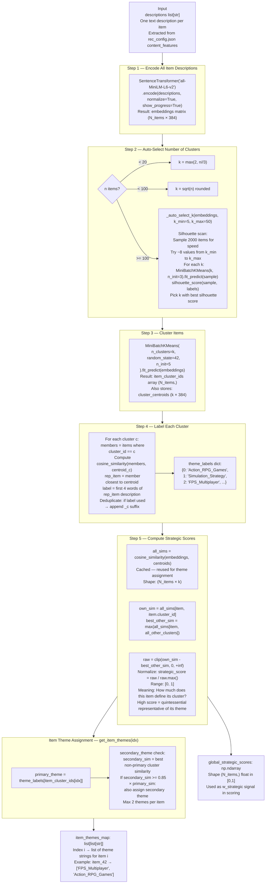

---

## Part 11 — Inference Loop — Scoring & Selection

> The core algorithm that generates recommendations for every user.

```mermaid
flowchart TD
    IN1(["LightGCN checkpoint\nDeepFM checkpoint"])
    IN2(["rec_config.json\nbusiness_goals + campaign IDs"])

    subgraph INIT["One-time Initialization"]
        I1["load_intelligence_map(rec_config.json)\nBusiness goals: perso/curation/promo %\nPromoted + clearance item ID sets"]
        I2["_apply_business_goals(cfg)\nN_recs = total_recommendations from config\nperso_quota = N × perso_pct\ncuration_quota = N × curation_pct\npromo_quota = N × promo_pct\nAdjust cold/moderate/dense quotas to match"]
        I3["load_recbole_model(retrieval_config)\n→ LightGCN config, dataset, model.eval()"]
        I4["load_recbole_model(ranking_config)\n→ DeepFM config, dataset, model.eval()"]
        I5["compute_popularity_scores(dataset)\nlog1p(interaction_count) per item\nNormalized to [0,1]"]
        I6["AutoThemeDiscovery.fit(descriptions)\n→ item_themes_map, strategic_scores"]
        I7["UserInterestProfiler(dataset, themes)\n→ pre-indexes user→items dict O(I)"]
        I8["ThompsonReranker(item_limit)\n→ _counts array initialized to zeros"]
        I1-->I2-->I3-->I4-->I5-->I6-->I7-->I8
    end

    subgraph BATCH["Batch Loop — 64 users at a time"]
        direction LR
        BL1["_run_batch_inference()\nStage 1 LightGCN:\n  Interaction({user_ids: tensor})\n  .full_sort_predict() → scores all N_items\n  torch.topk(k=retrieval_top_k) → top candidates\nStage 2 DeepFM:\n  Build batch_tensors from:\n    user_feats[user_indices] repeated k times\n    item_rows[topk_indices]\n  ranking_model.predict(batch_tensors)\n  Scatter scores back to (users × N_items) array\n  Non-top-K items stay at -999.0\nReturn: batch_ai_scores (batch × N_items)"]
    end

    subgraph PERUSER["Per-User Processing"]
        direction TB
        U1["Normalize AI scores\nretrieved = ai_scores > -900.0\nai_norm = min-max on retrieved subset\nNon-retrieved items stay 0"]

        U2["Eligibility gate\nthreshold = percentile(ai_norm[retrieved], 10)\neligible = retrieved where ai_norm >= threshold\nFilter out items in user.past_item_indices"]

        U3["Personalization scores\nuser_profile = UserInterestProfiler.get_profile(user_idx)\nFor each eligible item:\n  perso[item] = max(theme_weights[t] for t in item_themes[item])\n               × perso_match_multiplier (1.5)\n               capped at 1.0"]

        U4["Jitter injection\nif max(perso[eligible]) < 0.05 threshold:\n  Add Uniform(0, 0.05) to eligible items\n  Prevents all cold users getting identical ranks"]

        U5["Tier detection\ncold     if n_interactions < 5\nmoderate if n_interactions < 20\ndense    otherwise\n\nWeights per tier (curation, strategic, perso, popularity):\ncold:     (0.65, 0.10, 0.15, 0.10)\nmoderate: (0.30, 0.10, 0.50, 0.10)\ndense:    (0.15, 0.10, 0.70, 0.05)"]

        U6["Base score\nbase =\n  w_curation    × ai_norm\n+ w_strategic   × strategic_scores\n+ w_perso       × perso_scores\n+ w_popularity  × popularity_scores\n+ 0.40          × campaign_flag\n+ jitter"]

        U7["Thompson Sampling multiplier\nα = 1 + 50 × (ai_norm + pop_scores)\nβ = 1 + _counts[item]  ← impressions so far\nmultiplier = random.beta(α, β)\nHigh-impression items: β grows → multiplier shrinks\nCold items: β=1 → wide uncertain curve → exploration"]

        U8["Final score\nfinal = clip(base × multiplier + mask, -100, 2.0)\nmask = 0 for eligible, -100 for ineligible"]

        U1-->U2-->U3-->U4-->U5-->U6-->U7-->U8
    end

    subgraph SELECT["Quota-Based Selection"]
        direction TB
        Q1["Adaptive quotas by user tier\ncold:     (1 perso, 8 curation, 1 promo)\nmoderate: (5 perso, 4 curation, 1 promo)\ndense:    (7 perso, 2 curation, 1 promo)"]

        Q2["dynamic_threshold = percentile(perso_scores, 80)\ncuration_threshold = percentile(ai_norm, 60)"]

        Q3["Greedy loop over eligible sorted by final_score DESC:\n\n  1. is_over_exposed(item)?\n     Campaign items capped at 60% of users\n     Regular items: never blocked (Thompson handles it)\n     If over-exposed → skip\n\n  2. per_theme_cap: max 2 items per primary theme\n     If this theme full → skip\n\n  3. Classify item type:\n     is_admin_push (in promoted_ids OR clearance_ids)?\n       → promotion (if enable_promotion=True)\n     perso_score >= dynamic_threshold OR theme in user.top_themes?\n       → personalization\n     else\n       → curation\n\n  4. Check quota:\n     If natural_type slot available → assign there\n     Else → find any underfilled slot (fallback)\n     If all slots full → break\n\n  5. Record:\n     reranker.record_selection(idx) → _counts[idx] += 1\n     theme_usage[primary_theme] += 1"]

        Q4["Build recommendation dict:\n  item_id, description\n  recommendation_type\n  business_boosted, campaign_type\n  scores: final, ai_relevance, strategic,\n          personalization_match, popularity\n  explanation: matched_themes, reason string"]

        Q1-->Q2-->Q3-->Q4
    end

    OUT(["output/final_recommendations.json\n{user_token: [10 recs each with\n  scores + explanations]}"])

    IN1 & IN2 --> INIT --> BATCH --> PERUSER --> SELECT --> OUT
```

---

## Part 12 — Master Diagram

> Everything connected. Read top-to-bottom, left-to-right within each phase.

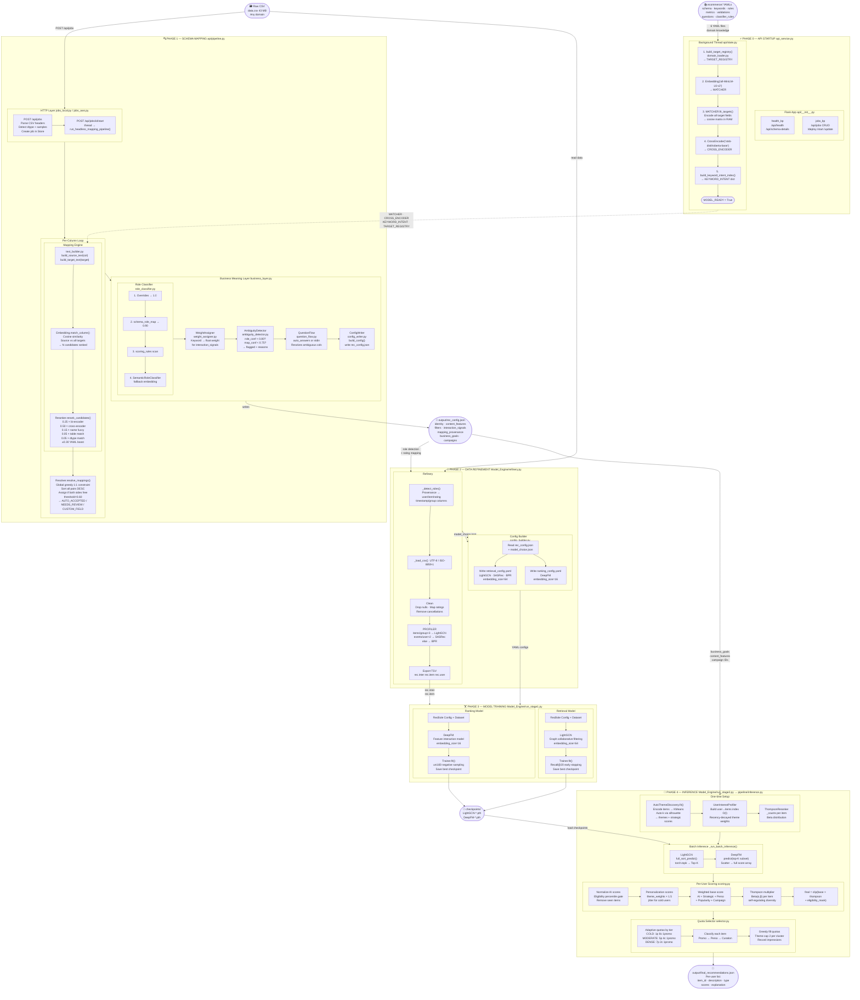

---

## Quick Reference — Key Numbers

| Metric | Value |
|--------|-------|
| Bi-encoder model | `all-MiniLM-L6-v2` — 384-dim vectors |
| Cross-encoder model | `cross-encoder/stsb-distilroberta-base` |
| Confidence threshold (mapping) | 0.60 |
| Auto-accept threshold | 0.99 |
| Role confidence threshold | 0.80 |
| Signal weights | 25% bi + 50% cross + 15% name + 5% table + 5% dtype |
| Cold user cutoff | < 5 interactions |
| Moderate user cutoff | < 20 interactions |
| Thompson alpha scale | 50.0 |
| Campaign exposure cap | 60% of users |
| Theme cap per user | 2 items per primary theme |
| Default quotas (dense) | 7 perso · 2 curation · 1 promo per 10 recs |
